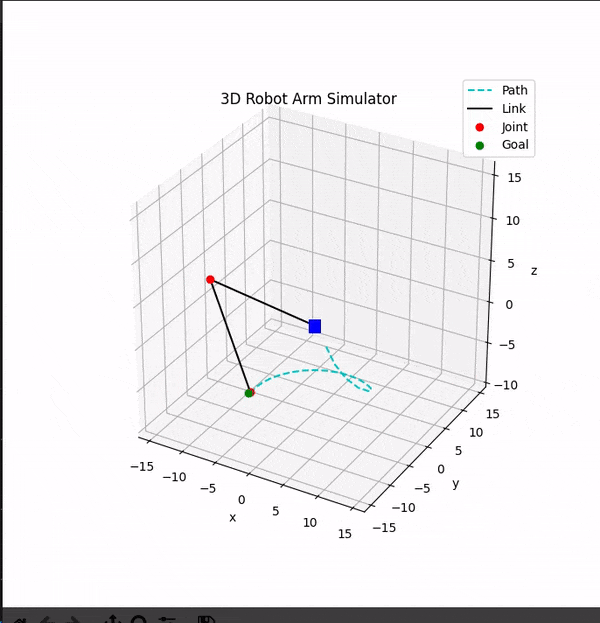

# 3D Robot manipulator
### **This code simulates the working of a 3DoF robot manipulator having three actuators. The simulation generates realtime animation of the arm.**  
## Language used
---
- Python-3.6.9

## Uses 
---
- Can be used to rectify Inverse and Forward kinematics of a 3DoF manipulator.
- Gives introduction to control aldorithm like PID.
- Can easily be modified to simulate real world parameters and noise incorporation.
- Various end effector path planning algorithms can also be added.
- Gives quick introduction to matplotlib 3D plotting and interactive plotting in matplotlib.

---
  
* ### blue square in above animation represents the base of the robot   
* ### the blue dot is the goal position which is being randomly changed once the previous one is reached.

